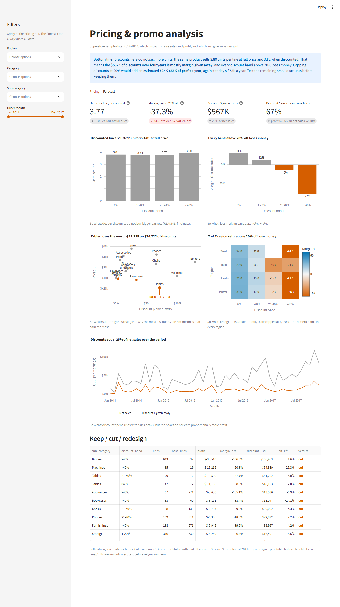
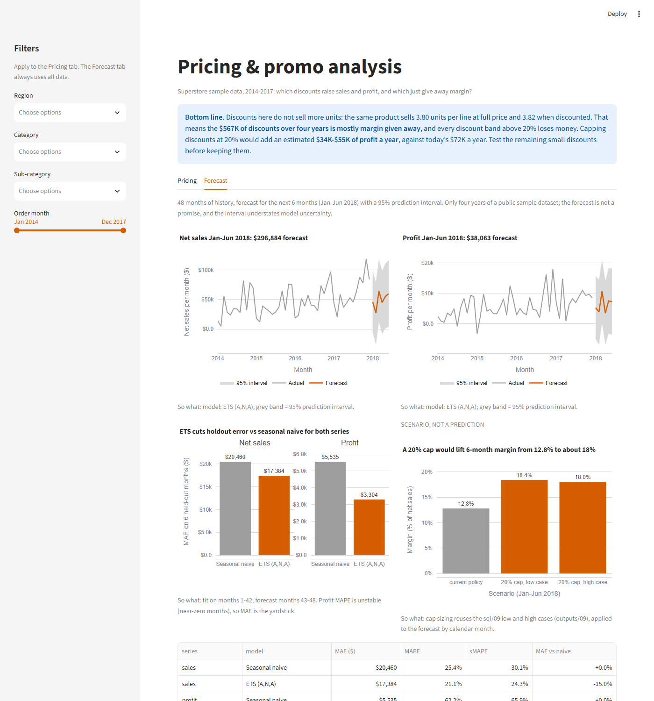
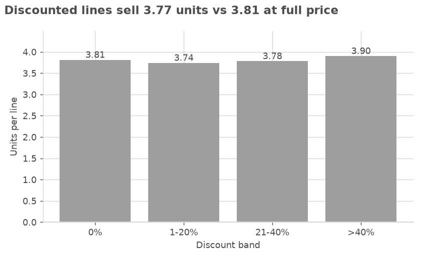
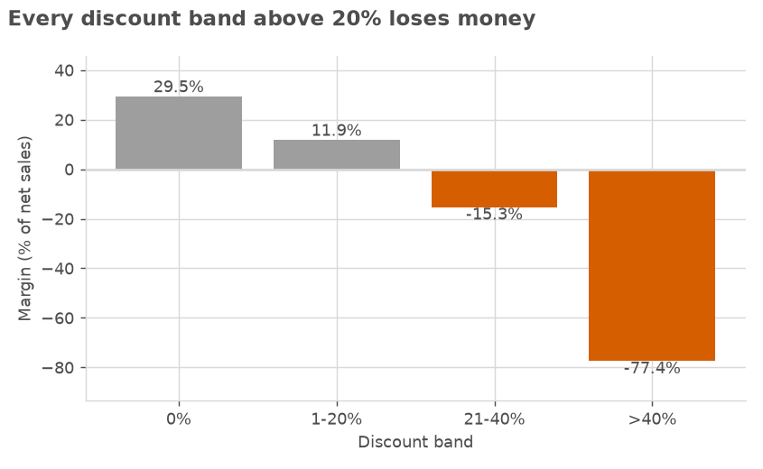
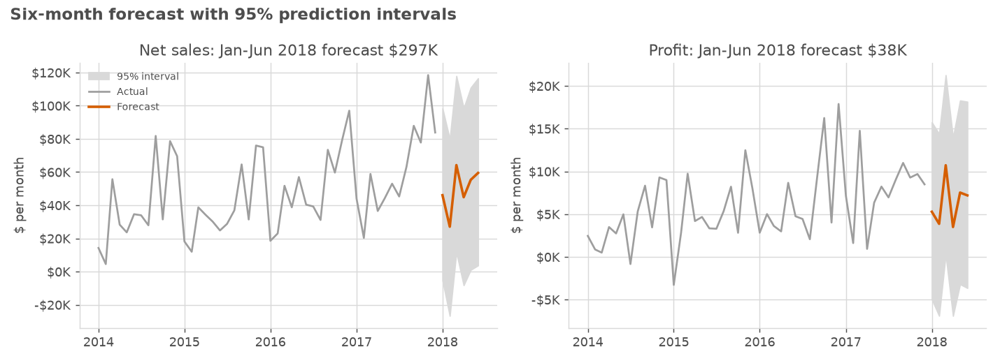
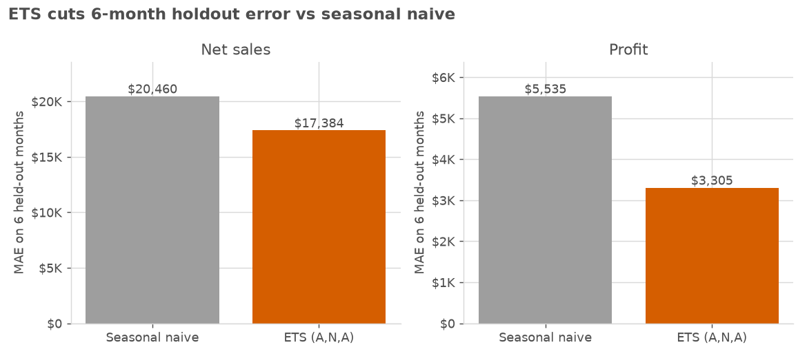
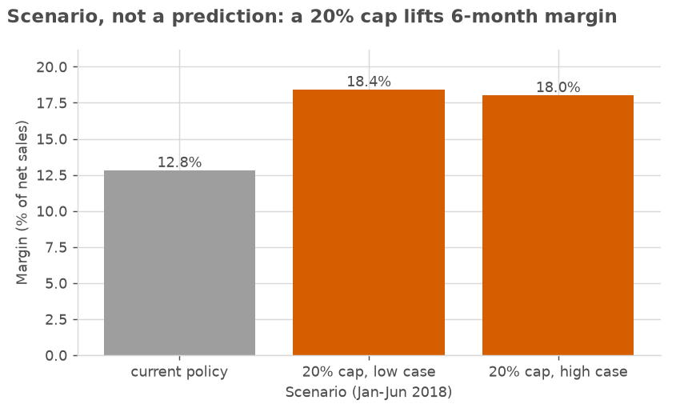

# Pricing & Promotion Analysis

**Question:** Which discounts and promotions raise revenue and profit, and which just give away margin?

**Data:** 9,994 order lines (5,009 orders, 2014–2017, US) from the Kaggle [Superstore Dataset](https://www.kaggle.com/datasets/vivek468/superstore-dataset-final). Each line has its list-price discount, quantity, net sales and profit. There is no promotion calendar, so a discounted line is treated as "on promotion" and undiscounted lines are the baseline. Superstore is a widely used sample retail dataset, not one company's audited books.

## Dashboard preview



The Forecast tab (6-month forecast, backtest and the discount-cap scenario):



```bash
streamlit run app.py
```

---

## 1. Bottom line

Discounts here do not sell more units. The same product sells 3.80 units per line at full price and 3.82 when discounted. That means the **$567K of discounts over four years is mostly margin given away**, and every discount band above 20% loses money. Capping discounts at 20% would add an estimated **$34K–$55K of profit a year**, against today's $72K a year. Test the remaining small discounts before keeping them.

## 2. Key findings

1. **Discounts are not linked to higher volume, so they mostly cost margin.** Units per line are flat across discount depth (3.81 at 0%, 3.74 at 1–20%, 3.78 at 21–40%, 3.90 above 40%). The cleanest test compares the same 1,440 products sold both ways: the difference is +0.01 units per line (95% CI −0.10 to +0.13; Wilcoxon p = 0.91). A regression that compares discounted and full-price lines *within the same state* also finds no volume effect at any depth (all p ≥ 0.33). It controls for sub-category and segment, with standard errors clustered by state.

   
2. **Margin falls off a cliff above 20%.** Undiscounted lines earn a 29.5% margin and 1–20% lines earn 11.9%. Lines discounted 21–40% run at −15.3%, with 90% of them losing money. Lines above 40% run at −77.4%, and every one of them loses money. Holding sub-category, region and segment constant, a discounted line earns $60 less profit at 1–20% off, $207 less at 21–40% and $230 less above 40% (all p < 0.001, state-clustered). The within-state comparison gives similar or larger gaps ($82, $241 and $269). Overall, 67% of all discount dollars went to lines that lost money.

   
3. **Deep discounting looks like a geographic policy, not a promotion.** Eleven states discount every single line, at an average of 34% off. Those states account for 78% of all discount dollars ($443K) and lose $98K at a −13.9% margin. The 21 states that never discount earn a 29.8% margin and sell as many units per line (3.90 vs 3.76).
4. **Deeper discounts lose money in every region.** Within each region, undiscounted margin is 27–31%. Lines discounted 21–40% are negative in every region that has them, and lines above 40% range from −34% (South) to −135% (Central). Region is a coarse control, because discounting is set by state. The within-state comparison in finding 1 is the stronger check, and it does not reverse the result.
5. **Thirteen sub-category and discount-depth combinations lose a combined $143K.** The largest are Binders above 40% (−$38.5K on 613 lines), Machines above 40% (−$27.2K) and Tables at 21–40% (−$19.6K). Even at 1–20%, Storage, Supplies and Tables lose money. Only three small-discount cells show a unit lift above +5% (Fasteners, Bookcases and Phones), and none of those lifts is confirmed.

## 3. Recommendations (ranked by impact vs. effort)

| # | Action | Owner | Expected impact (assumptions) | How to measure |
|---|---|---|---|---|
| 1 | **Cap all discounts at 20%**, starting with Binders, Machines and Tables in the 11 always-discount states. Replace blanket state-wide discounts with targeted offers. | Head of Pricing, with Regional Sales Managers | **+$33.8K to +$54.8K profit a year.** The low case assumes every affected sale is lost at the higher price, so only today's losses stop. The high case assumes every sale still happens at 20% off. The missing volume lift does not rule out the high case. Low effort: a price-rule change. | Margin in the 11 states (−13.9% today); units per line and order counts in those states vs the rest |
| 2 | **Drop 1–20% discounts on Storage, Supplies and Tables**, which lose money even at shallow depth. | Category Manager, Office Supplies & Furniture | **+$1.9K to +$7.9K profit a year**, under the same low/high logic. Low effort. | Sub-category margin; units per line |
| 3 | **Test before keeping the other 1–20% discounts.** Remove them for a random half of customers or states for one quarter, with the other half as the control. | BI / Analytics lead, with Marketing | **$0 to $42.6K a year** of margin at stake. These discounts are profitable in aggregate, so the floor is no change. Low effort, and it settles the causal question. | Units per line, orders per customer and margin, test vs control |

At the bounds, recommendations 1 and 2 together add $36K–$63K a year, set against average annual profit of $71.6K ($286.4K over four years).

## 4. Forecast: next 6 months (Jan–Jun 2018)

**What it answers:** what to expect from net sales and profit over the next six months at today's discount policy, and what margin a 20% cap would imply. This is a baseline for planning, not a promise.



- **Forecast** (`outputs/12_forecast.csv`): net sales of **$296.9K** and profit of **$38.1K** over Jan–Jun 2018, a **12.8%** margin (`14_forecast_scenario_margin.csv`). Each month has a 95% prediction interval, and the intervals are wide. For example, the profit interval for January runs from −$5.0K to +$15.7K.
- **Backtest** (`11_forecast_backtest.csv`): the last 6 months (Jul–Dec 2017) were held out and the models were fit on months 1–42. ETS beat the seasonal-naive baseline on both series, so ETS is used:

| Series | Seasonal naive MAE | ETS MAE | MAE change | Seasonal naive MAPE | ETS MAPE |
|---|---|---|---|---|---|
| Net sales | $20,460 | $17,384 | −15.0% | 25.4% | 21.1% |
| Profit | $5,535 | $3,304 | −40.3% | 62.2% | 37.6% |

  Profit MAPE is unstable because some months have near-zero or negative profit, so MAE is the metric to use. The selection rule is MAE on this single 6-month holdout.



- **Scenario, not a prediction** (`13_forecast_scenario.csv`, `14_forecast_scenario_margin.csv`): the discount-cap logic from `sql/09` is applied to the forecast by calendar month (the four-year total for lines above 20% off, divided by 4). The low case loses every affected line; the high case keeps every line at 20% off. Over Jan–Jun 2018:

| Case | Net sales | Profit | Margin |
|---|---|---|---|
| Current policy (forecast) | $296.9K | $38.1K | 12.8% |
| 20% cap, low case | $263.4K | $48.4K | 18.4% |
| 20% cap, high case | $315.6K | $56.8K | 18.0% |

  The cap lifts margin by about 5 to 6 points in both cases, even though the low case shrinks sales. The uplift is the historical average for those months. It is not re-fitted to the forecast level.



## 5. Method and rigor

- **Pipeline:** `clean.py` (runs `sql/00_clean.sql`) → `analyze.py` (runs `sql/01`–`10`, the paired test and the regressions, and writes `outputs/*.csv`) → `forecast.py` (6-month forecast, writes `outputs/11`–`14`) → `app.py` (Streamlit dashboard). Every number in this README comes from a file in `outputs/` or from simple arithmetic on one.
- **Cleaning:** each check is logged with its row count in [DATA_QUALITY.md](DATA_QUALITY.md). No rows were invalid. One exact duplicate line was kept as a plausible repeat purchase. The country column (always the United States), customer name, postal code and row ID were dropped.
- **Definitions:**
  - *Net sales* = `Sales`, which is after the discount.
  - *Gross sales* = sales ÷ (1 − discount).
  - *Discount $* (margin given away) = gross − net.
  - *Margin* = profit ÷ net sales.
  - *Discount bands* are 0%, 1–20%, 21–40% and >40%. The data has 12 distinct discount levels.
  - *Unit lift* = average units per line ÷ the same sub-category's 0% average − 1.
- **Causal care:**
  - Discounts are assigned by state, so comparing raw bands mixes geography with price. Three checks guard against that:
    - a paired comparison of the same product at full and discounted price (`04`, `stats_lift.csv`);
    - OLS controlling for sub-category, region and segment, plus a within-state version with state fixed effects. Both cluster standard errors by state (`stats_volume_model.csv`);
    - a region-by-band breakdown (`05`).
  - The paired lift is reported as a mean paired difference with a t interval, plus a ratio of the two product-level means. A mean of per-product ratios was rejected: with few lines per product it is biased upward (it showed a spurious +19%).
- **Keep / cut / redesign rule** (`08`): *cut* means margin ≤ 0; *keep* means profitable with a unit lift above +5% against a 0% baseline of at least 20 lines; *redesign* means profitable with no clear lift. Cells need at least 20 lines.
- **Impact sizing:** `sql/09_impact_scenarios.sql`. Annual figures divide the four-year totals by 4.
- **Forecast** (`forecast.py`): monthly net sales and profit come from `outputs/07_monthly.csv` (net sales = `Sales` as recorded, already after discount). Models are a seasonal-naive baseline (value from 12 months earlier; 95% interval from the spread of year-over-year differences) and ETS with additive error, no trend and additive seasonality (95% interval from 5,000 simulated paths, fixed seed). One specification is used for both series, because profit has negative months. The backtest holds out the last 6 months and uses only earlier data. The script asserts the interval ordering, the holdout split, and that the sizing matches `09_impact_scenarios.csv`. Output is deterministic.

## 6. Limitations and risks

- **Line-level demand only.** Quantity per line measures basket size, not demand. A discount could still bring in more orders or new customers, which this analysis does not measure. That is the main reason recommendation 3 is a test, not a cut.
- **No promotion metadata.** There are no promotion IDs, calendars, marketing spend or competitor prices. Some of what this treats as "promotion" may be negotiated or contract pricing.
- **Geography is confounded with discounting.** The paired product test and the within-state regression reduce this but cannot remove it. The within-state comparison can only use the 17 states that sell both discounted and full-price lines. Customers in always-discount states may differ in ways the data does not record.
- **Cost is derived.** Cost is net sales minus profit, and the method behind the dataset's profit allocation is not documented.
- **Small cells.** Several sub-category and band cells have fewer than 50 lines (for example, Machines above 40% has 35 lines). Treat their lift values as directional.
- **Representativeness.** This is a public sample dataset, so the magnitudes illustrate the method rather than a specific retailer's P&L.
- **Forecast limits.** There are only 48 months, four seasonal cycles, and the backtest is a single 6-month window, so the model comparison is noisy. The forecast assumes past patterns continue. The additive intervals are wide and go below zero for net sales in some months, and they understate model uncertainty. The cap scenario reuses the historical average effect and is a scenario, not a prediction.

## 7. Next steps

1. Add order frequency and customer acquisition by state, to check whether discounts win customers rather than units per order.
2. Run the recommendation 3 holdout test and read it after one quarter, sized to detect a 10% unit lift.
3. Extend the backtest to several rolling origins once more history is available, and add a promotion calendar as a regressor.
4. Join real promotion calendars and marketing spend to separate planned promotions from standing price cuts.
5. Rebuild the sizing on transaction-level cost data, if it is available.

---

## Run it

```bash
python -m venv .venv && .venv/Scripts/activate        # Windows; use .venv/bin/activate on macOS/Linux
pip install -r requirements.txt
# Raw data (not committed; needs a Kaggle API token in ~/.kaggle/kaggle.json):
python -m kaggle datasets download vivek468/superstore-dataset-final -p data/raw --unzip
python clean.py      # -> data/clean/lines.parquet, DATA_QUALITY.md
python analyze.py    # -> outputs/*.csv
python forecast.py   # -> outputs/11-14 (forecast, backtest, scenario)
streamlit run app.py
```

The cleaned parquet file is committed, so the dashboard runs straight after cloning.

**Dashboard:** a Pricing tab (four KPI cards, five charts, and the keep / cut / redesign table; sidebar filters for region, category, sub-category and date) and a Forecast tab (forecast with 95% interval per series, backtest vs baseline, and the cap scenario). The Forecast tab always uses all data. The figures in `assets/` are made by `make_figures.py`.

| Path | What it is |
|---|---|
| `clean.py`, `sql/00_clean.sql` | Cleaning and data-quality log |
| `sql/01`–`10_*.sql` | One commented query per question |
| `analyze.py` | Runs the queries, the paired lift test and the regressions |
| `forecast.py` | 6-month forecast, backtest and cap scenario (`outputs/11`–`14`) |
| `app.py`, `charts.py`, `.streamlit/config.toml` | Streamlit dashboard, chart helpers, theme |
| `make_figures.py`, `assets/` | README figures (matplotlib) and dashboard screenshots |
| `outputs/` | Results behind every number above |

## License

Code: MIT (see `LICENSE`). Data: the Superstore sample dataset, as published on Kaggle by user vivek468.
